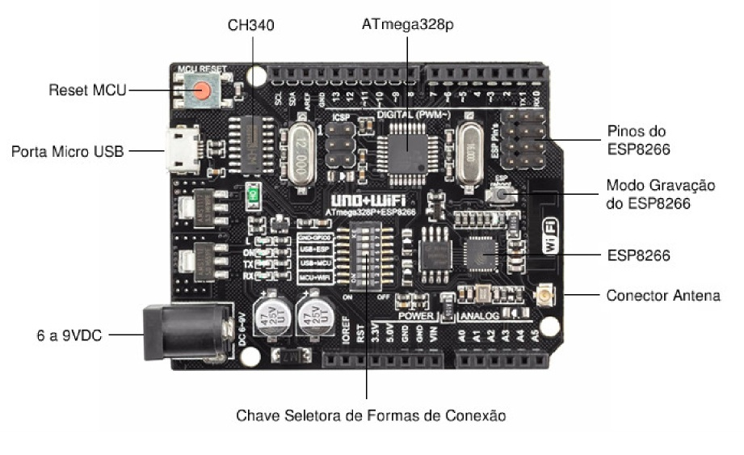
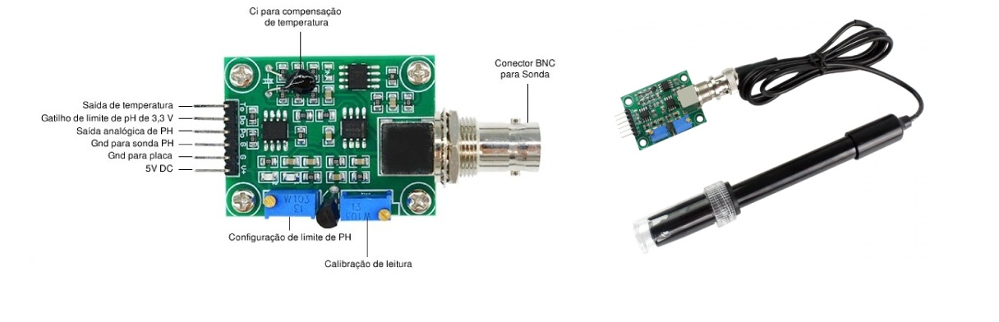
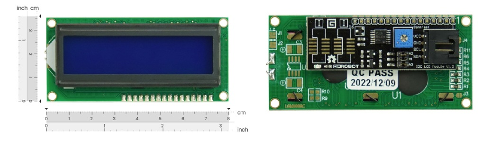
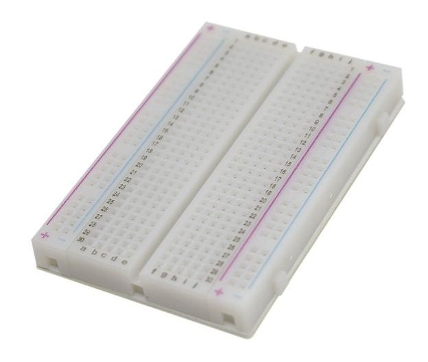
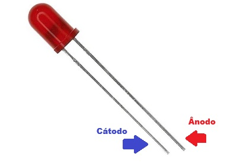
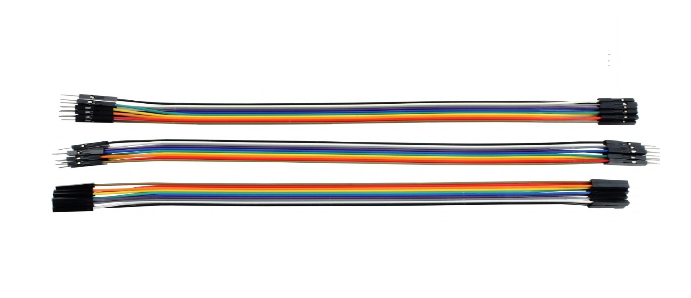
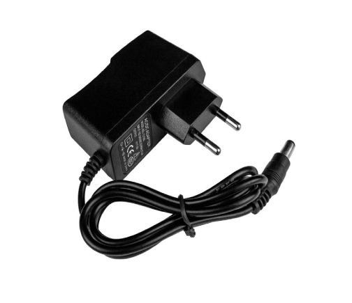
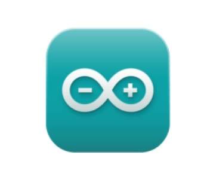

# IaraWatch pH Monitor – Arduino + ESP8266 + MQTT

IARAWATCH é um sistema de monitoramento de qualidade da água baseado em Arduino, projetado para medir e transmitir valores de pH em tempo real. O projeto utiliza dois microcontroladores — ATmega328P (Arduino UNO) e ESP8266 — que atuam em conjunto: o ATmega realiza a leitura analógica do sensor de pH e controla o LED (atuador), enquanto o ESP8266 se conecta à rede Wi-Fi e envia os dados via protocolo MQTT para um broker local (Mosquitto).

Os dados enviados incluem:

- Valor de tensão lido do sensor,

- Valor de pH convertido via fórmula calibrada,

- Tempo de reação do LED, caso o pH esteja fora da faixa segura (6.5–8.5),

- Timestamp da leitura, sincronizado com um servidor NTP (hora UTC-3).

- O sistema exibe os dados em um display LCD 16x2 e também pode ser monitorado por um script Python que calcula automaticamente o tempo médio de resposta do atuador e da comunicação MQTT.

Este projeto foi pensado para ser acessível, modular e didático, permitindo que estudantes, pesquisadores ou entusiastas em automação e IoT possam reproduzi-lo com facilidade utilizando componentes comuns e de baixo custo.

## Hardware e Itens Auxiliares Utilizados:

### A) Placa Arduino Uno WiFi (ATmega328P + ESP8266)

A placa Arduino Uno WiFi combina o microcontrolador ATmega328P com o módulo Wi-Fi ESP8266, permitindo conectividade sem fio e controle de dispositivos via internet. Possui 14 pinos digitais (6 com PWM), 6 entradas analógicas, cristal de 16 MHz e interface USB-TTL CH340G. A comunicação entre o ATmega328P e o ESP8266 é configurável por meio de DIP switches, permitindo flexibilidade na programação e na comunicação serial.

 

#### Especificações Arduino Uno WiFi (ATmega328P + ESP8266):

- Modelo: Placa Uno Wifi Atmega328P;
- Alimentação Jack P4: 6-9VDC;
- Entrada de energia USB: 5V (500mA máx.);
- Microcontrolador: ATmega328P SMD;
- Wi-Fi IC: ESP8266;
- Conversor USB-TTL: CH340G;
- Nível lógico: 5V;
- Wi-Fi: 802.11 b/g/n 2.4 GHz;
- Conexão: Micro USB;
- Frequência de clock: 16MHz;
- Pinos: Digitais = 14 (6 PWM) / Analógicos = 6;
- Memória: 32kb;
- RAM: 2Kb;
- ROM: 2Kb;
- Temperatura de operação: -40 a 125°C;
- Dimensões (CxLxE): 68x53x10mm;
- Peso: 22g.

### B) Sensor de pH PH-4502C

 

O sensor de pH PH-4502C é utilizado para medir o nível de acidez ou alcalinidade de soluções líquidas, convertendo o valor de pH em um sinal analógico compreendido pelo microcontrolador. Ele opera com tensão de 5V DC, possui faixa de medição entre pH 0 e 14, tempo de resposta ≤5s e precisão de ±0,1 pH a 25°C. O módulo acompanha dois potenciômetros integrados: um para ajuste de offset (calibração) e outro para definir o limite de pH de atuação.

Neste projeto, o sensor é o responsável pela coleta do valor de pH da água, enviando os dados ao ATmega328P, que realiza a conversão e posterior transmissão ao módulo ESP8266 para exibição e monitoramento via MQTT.

#### Especificações PH-4502C:

- Modelo: PH-4502C;
- Tensão de aquecimento: 5 ±0.2V (AC/DC);
- Corrente de trabalho: 5-10mA;
- Faixa de temperatura: 0-60℃;
- Tempo de resposta: 5S;
- Tempo de sedimentação: 60S;
- Componente Potência: 0,5 W;
- Saída: Analógica;
- Faixa de medição: 0,00 ~ 14,00 pH
- Zero pontos: 7 +-0.5ph;
- Erro alcalino: 0.2pH;
- Resistência interna: <250MOhm;
- Blocos de terminais: Plug BNC;
- Comprimento do cabo: 70cm;
- Dimensões do módulo (CxLxE): 42x32x13mm (ignorando-se conectores);
- Dimensões do sensor (CxD): 170x12,5mm;
- Peso: 75g;
- Peso com embalagem: 85g.

### C) Display LCD 16x2 com Interface I2C

 

O display LCD 16x2 com interface I2C é utilizado neste projeto para exibição local das medições realizadas pelo sensor, como o valor de pH da água e a condição atual ("Própria" ou "Imprópria"). Sua integração com o ESP8266 via barramento I2C (utilizando apenas os pinos SDA e SCL) permite uma comunicação eficiente com o microcontrolador, economizando pinos digitais para outras conexões.

Além disso, o módulo conta com retroiluminação azul, caracteres brancos e ajuste de contraste via potenciômetro integrado, o que garante boa visualização em ambientes com pouca luz, mesmo quando o sistema estiver sem conexão com o servidor.

#### Especificações LCD 16x2 I2C:

- Modelo: DFR0063
- Tipo de Display: Alfanumérico (16 caracteres por 2 linhas)
- Controlador: HD44780
- Interface de Comunicação: I2C (TWI)
- Tensão de Operação: 5V DC
- Corrente de Operação: ≤60mA
- Endereço I2C padrão: 0x20 (configurável entre 0x20 e 0x27)
- Pinos de Conexão: VCC (5V), GND, SDA (dados), SCL (clock)
- Ajuste de Contraste: Potenciômetro integrado
- Retroiluminação: LED azul com caracteres brancos
- Dimensões: 80 x 36 x 20 mm
- Compatibilidade: Arduino UNO, Mega, Nano e similares

### D) Protoboard

A protoboard é amplamente utilizada na fase de prototipagem do projeto, permitindo a montagem dos circuitos sem necessidade de solda. Isso facilita o teste, ajuste e organização dos componentes como sensores, atuadores, jumpers e o microcontrolador.

Sua estrutura conta com trilhas verticais e horizontais, barramentos laterais de alimentação (positiva e negativa) e furos que suportam cabos jumper padrão. No projeto, ela é responsável por distribuir a alimentação fornecida pelo Arduino para o display, sensor de pH e LED, de maneira modular e segura.

#### Especificações Técnicas Protoboard 400 Pontos:

- Protoboard 400 Pontos Solderless Breadboard
- Modelo: Solderless Breadboard
- Marca: OEM
- Ideal para protótipos de circuitos eletrônicos para futuros projetos
- Base adesivada
- Furo padrão 0.8mm
- Corrente máxima: 5A
- Tensão máxima: 300V
- Cor: Branco
- Composição: ABS
- Origem: China
- Tamanho: 82mm Comprimento x 55mm Largura x 10mm de Altura
- Peso: 43g

### E) LED Difuso 5mm

O LED difuso de 5mm é utilizado como atuador visual no projeto. Ele acende sempre que o valor de pH sai da faixa considerada segura, indicando uma condição de alerta. É conectado ao pino digital D9 do ATmega328P e tem seu brilho controlado por meio de sinal PWM.

Este componente torna visível e imediata a resposta do sistema às medições do sensor de pH, sendo essencial para testes de tempo de reação e validação do funcionamento do atuador.

#### Especificações Técnicas do LED Difuso 5mm:

- Tamanho: 5 mm
- Tensão de operação: 2.0 ~ 2.21 V
- Corrente típica: 20 mA
- Intensidade luminosa: 1000 mcd
- Vida útil: 50.000 horas
- Ângulo de abertura: 120°
- Cor: Vermelho difuso

### F) Cabos Jumper Fêmea/Macho, Macho/Macho e Fêmea/Fêmea

Os cabos jumper são essenciais para realizar conexões rápidas entre sensores, microcontroladores e módulos em uma protoboard, eliminando a necessidade de solda durante a fase de prototipagem. O projeto utiliza três tipos principais:

- Fêmea/Macho: utilizados para conectar o ESP8266 (pinos do tipo header) diretamente à protoboard;

- Macho/Macho: usados para ligações entre a protoboard e pinos do Arduino;

- Fêmea/Fêmea: utilizados em conexões diretas entre módulos com pinos do tipo macho, como o display LCD e o sensor de pH.

Composição utilizada no projeto:

- 6x cabos jumper Fêmea/Macho

- 2x cabos jumper Macho/Macho

- 2x cabos jumper Fêmea/Fêmea

#### Especificações dos Jumpers:

- Modelo: MJ20-30
- Tipo: Fios flexíveis
- Bitola: 24 AWG
- Cores: Sortidas
- Comprimento: 20 cm
- Tipos inclusos: fêmea x fêmea, macho x fêmea, macho x macho
- Aplicação: Compatíveis com Arduino, ESP8266, sensores e módulos

### G) Fonte Bivolt 100–240V 9V 1A Plug P4

A Fonte Bivolt 9V 1A com plug P4 é utilizada no projeto como a principal responsável por fornecer energia à placa Arduino UNO R3. Por ser compatível com tensões de entrada entre 100V e 240V, pode ser utilizada em diferentes localidades sem a necessidade de chaveamento manual.

Neste projeto, a fonte é conectada diretamente à porta fêmea P4 da placa Arduino, garantindo uma alimentação estável e contínua para todos os componentes conectados à protoboard por meio do microcontrolador.

#### Especificações da Fonte Bivolt 100–240V 9V 1A Plug P4:

- Modelo: KDL-121000
- Tipo: AC/DC
- Entrada: 100–240V AC (50/60Hz) – 0.3A
- Saída: 9V DC – 1A
- Plug: P4 (5,5mm externo / 2,1mm interno)
- Pino Central: Positivo
- Comprimento do cabo: 85 cm
- Indicador LED de funcionamento: Sim
- Material: Metal / Termoplástico / Componentes Eletrônicos
- Dimensões: 75mm (C) x 28mm (L) x 78mm (A)
- Peso: 61g

## Software IDE e Broker MQTT:

### Arduino IDE

Para o desenvolvimento do firmware embarcado, foi utilizada a Arduino IDE, uma plataforma robusta e amplamente adotada no ecossistema maker e educacional. Com suporte à linguagem C/C++ e integração nativa com placas baseadas no microcontrolador ATmega328P, a IDE permitiu:

- A escrita e organização dos códigos-fonte;

- A utilização de bibliotecas específicas para sensores, módulos de comunicação (como o ESP8266), controle de periféricos e displays LCD;

- A compilação e envio (upload) dos programas diretamente para o microcontrolador da placa, via porta serial;

- O monitoramento do comportamento do sistema por meio do Monitor Serial embutido na IDE.

Essa interface simplificada e compatível com múltiplos sistemas operacionais (Windows, macOS e Linux) contribuiu para uma experiência de desenvolvimento fluida e confiável durante todas as etapas do projeto.

### Mosquitto Broker MQTT

Para a comunicação entre o módulo ESP8266 e os sistemas de monitoramento, foi utilizado o Mosquitto, um broker MQTT leve, gratuito e de código aberto.

Instalado localmente no computador, o Mosquitto foi responsável por:

- Gerenciar os tópicos de publicação e assinatura MQTT;

- Receber dados periódicos enviados pelo ESP8266;

- Encaminhar os dados aos clientes assinantes (por exemplo, scripts Python e comandos via terminal).

A configuração envolveu definir a porta padrão 1883, criar um tópico principal (pH/valor) e validar os envios por meio de ferramentas como mosquitto_sub, garantindo assim um canal de comunicação eficiente e confiável para o monitoramento dos parâmetros do sistema em tempo real.

Essa estrutura de comunicação MQTT contribuiu diretamente para a escalabilidade e a reatividade do projeto IaraWatch.

## Montar Componentes Físicos:

### 🔌 Etapa 1 – Alimentação da placa e distribuição para a protoboard

1. Conecte a fonte bivolt 9V 1A Plug P4 na entrada P4 fêmea da placa Arduino Uno WiFi.

2. Com dois jumpers macho-macho (um vermelho e um azul):

  - Conecte o pino 5V do Arduino ao barramento positivo da protoboard (linha vermelha).

  - Conecte o pino GND do Arduino ao barramento negativo da protoboard (linha azul/preta).

3. Isso garante que a protoboard esteja alimentada com os mesmos 5V do Arduino.

### 🔧 Etapa 2 – Configuração das chaves DIP

